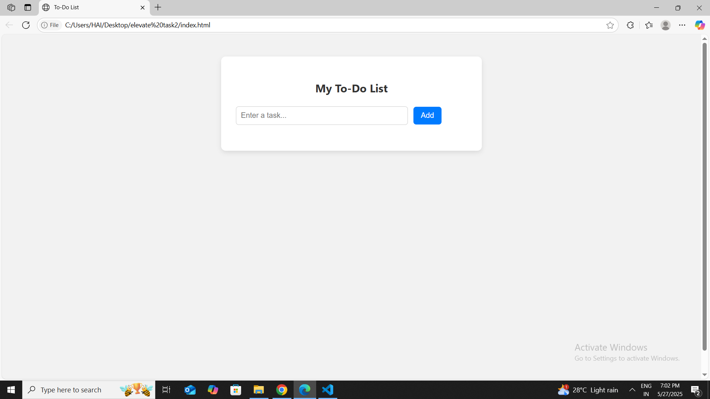
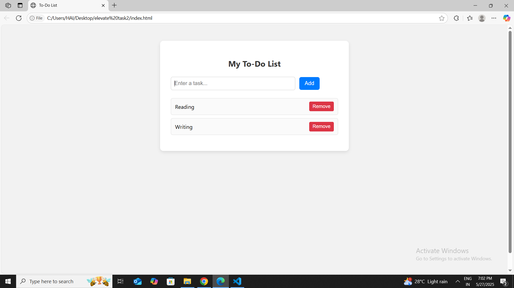

# todo-app
A simple and responsive To-Do List web app built using only HTML, CSS, and vanilla JavaScript. Add, complete, and delete tasks with real-time UI updates — no page reloads!
-  Add new tasks
-  Mark tasks as completed (toggle with click)
-  Remove individual tasks
-  Instant UI updates
-  Clean, mobile-friendly layout

